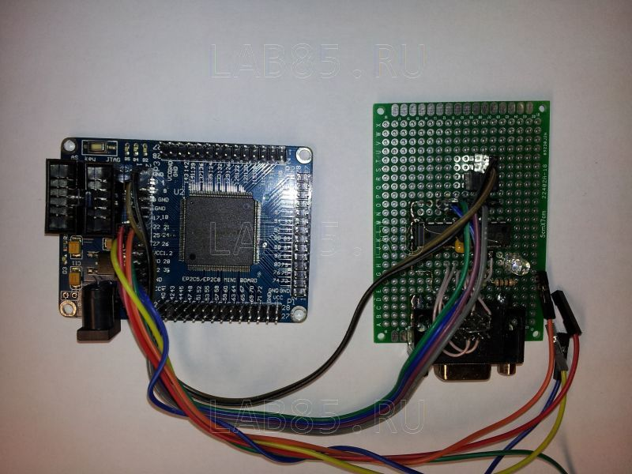
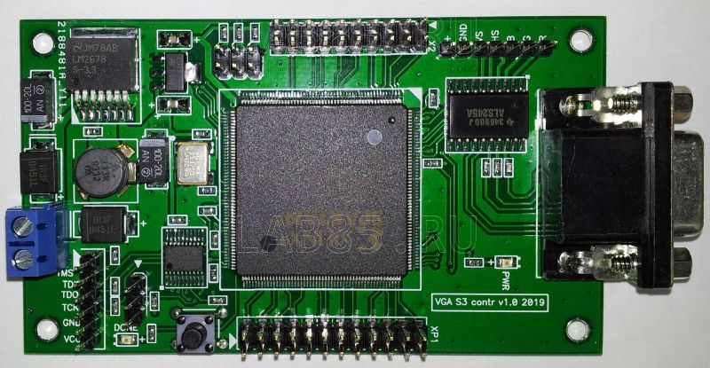
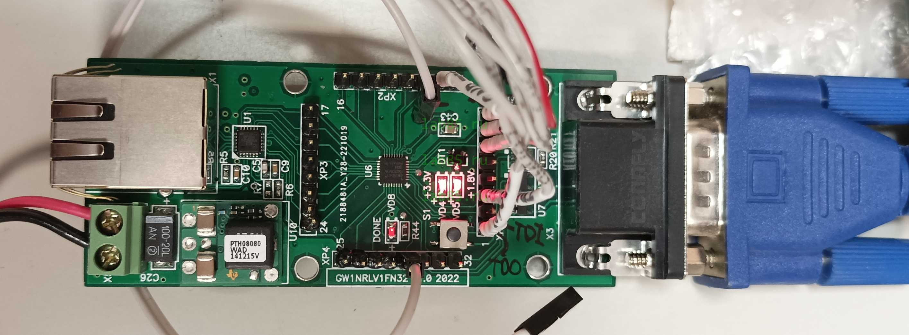
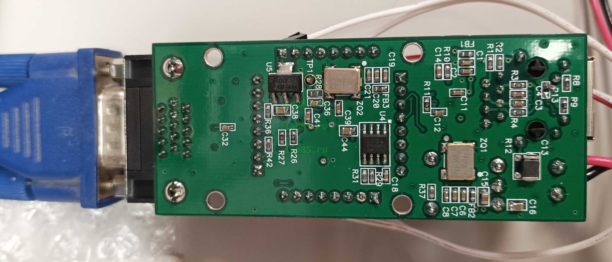
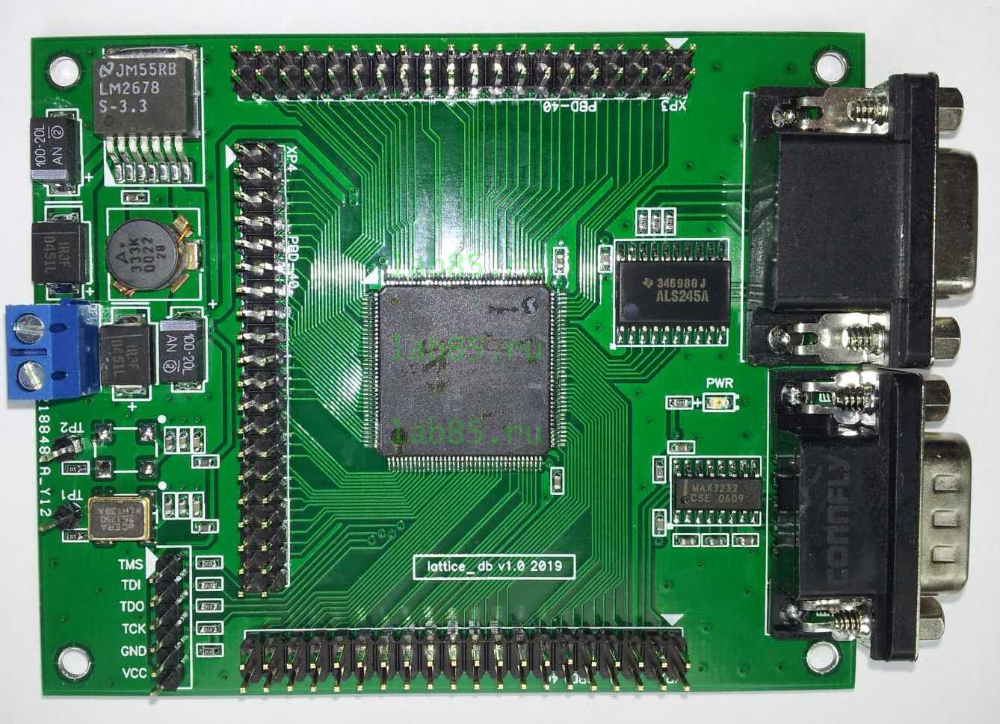
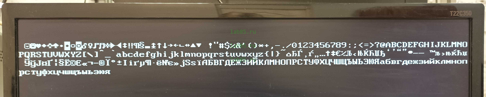
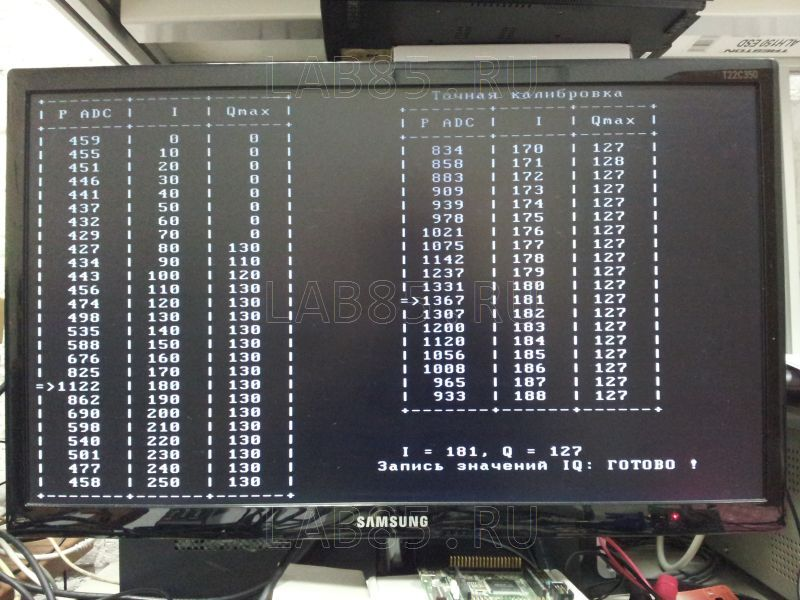

# VGA_TXT_Controller
VGA FPGA Text controller.

PixelClk - 25,175 MHz or 25 MHz.
Size - 494 LE.

[https://lab85.ru](https://lab85.ru/index.php/laboratoriya-stati/46-fpga-tekstovyj-video-kontroller-na-verilog)

ALTERA Cyclone-2 EP2C5:

Spartan-3 XC3S50:

GoWin GW1NZ-LV1FN32C6/I5:

Lattice MachXO2 LCMXO2-7000HC:

Test Font 8x16:

Device calculate result to VGA:

